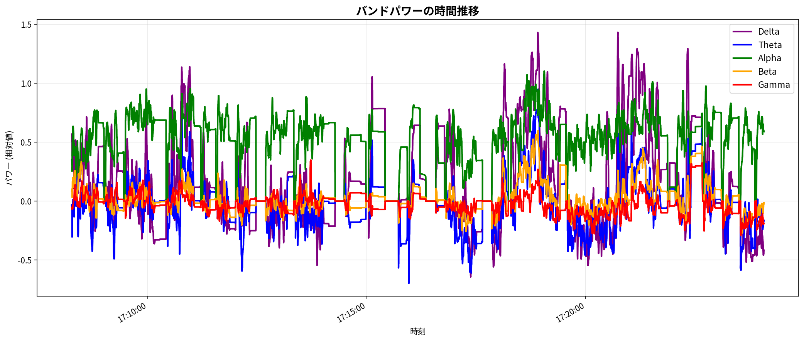
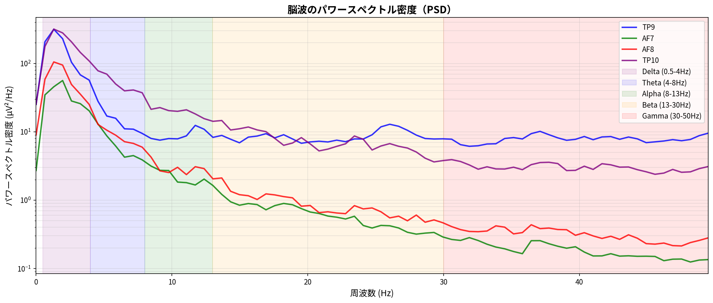
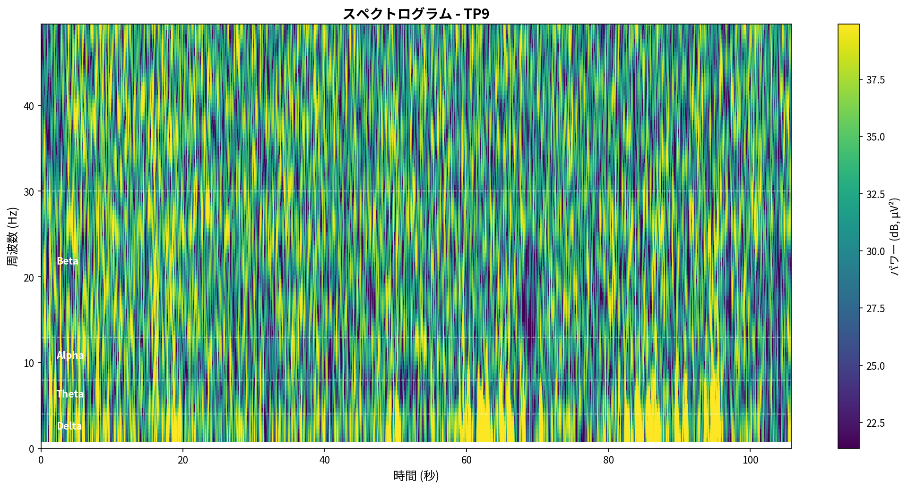
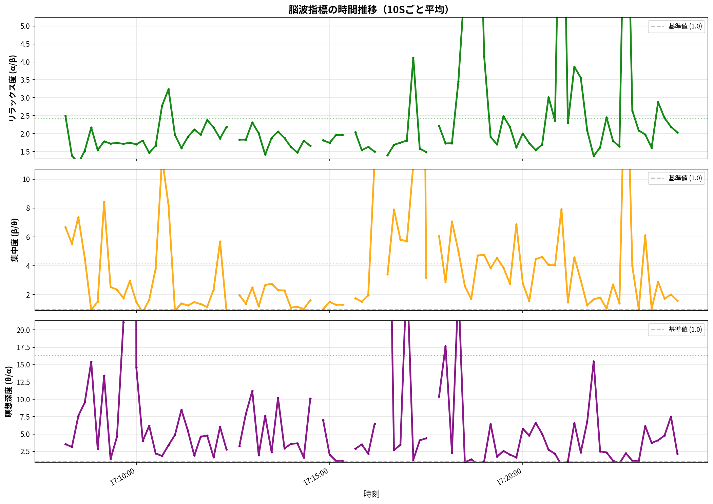
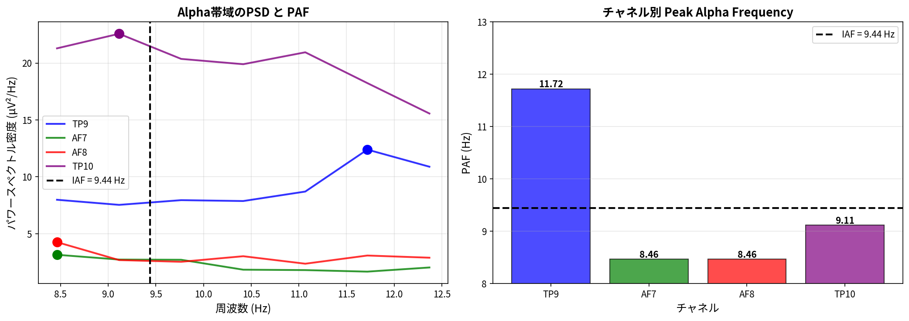
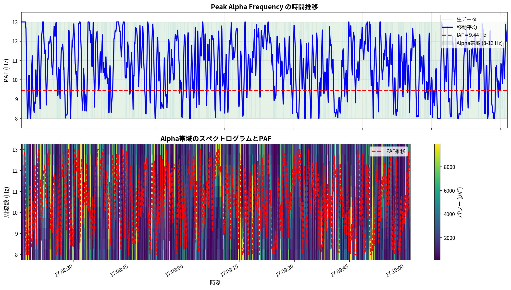

# Muse脳波データ分析レポート

**生成日時**: 2025-10-30 17:54:36
**データファイル**: `mindMonitor_2025-10-15--17-08-15_2188947289907039573.csv`

---

## 1. データ概要

- **データ形状**: (180138, 60)
- **記録時間**: 2025-10-15 17:08:15.735000 ~ 2025-10-15 17:24:03.986000
- **計測時間**: 948.3 秒

## 2. 周波数バンド統計

| バンド   |   平均値 |   標準偏差 |   有効データ率 (%) |
|:---------|---------:|-----------:|-------------------:|
| Delta    |   0.1791 |     0.5250 |            89.9793 |
| Theta    |  -0.0279 |     0.4598 |            89.9793 |
| Alpha    |   0.5941 |     0.6451 |            89.9793 |
| Beta     |   0.0309 |     0.4484 |            89.9793 |
| Gamma    |  -0.0319 |     0.5754 |            89.9793 |

**周波数バンドの説明**:
- **Delta (0.5-4 Hz)**: 深い睡眠
- **Theta (4-8 Hz)**: 瞑想、創造性
- **Alpha (8-13 Hz)**: リラックス、目を閉じた状態
- **Beta (13-30 Hz)**: 集中、活動
- **Gamma (30-50 Hz)**: 高度な認知処理

## 3. バンドパワーの時間推移

Alpha波が高いとリラックス状態、Beta波が高いと集中状態を示します。

## 4. パワースペクトル密度（PSD）

### 各バンドのピーク周波数

| バンド   |   ピーク周波数 (Hz) |
|:---------|--------------------:|
| Delta    |                1.30 |
| Theta    |                4.56 |
| Alpha    |                8.46 |
| Beta     |               13.67 |
| Gamma    |               37.11 |

## 5. スペクトログラム

時間とともに周波数分布がどう変化するかを可視化しています。

## 6. 脳波指標（バンド比率）

### 指標サマリー

| 指標               |   平均値 |   中央値 |   標準偏差 |   最小値 |    最大値 |
|:-------------------|---------:|---------:|-----------:|---------:|----------:|
| リラックス度 (α/β) |    2.648 |    1.849 |     13.085 |    0.384 |   691.172 |
| 集中度 (β/θ)       |    4.871 |    1.515 |     73.863 |    0.321 |  5603.467 |
| 瞑想深度 (θ/α)     |   21.073 |    1.680 |   1196.333 |    0.087 | 94546.550 |

### セッション評価

- **リラックス度 (α/β)**: 2.648 (とても高い)
- **集中度 (β/θ)**: 4.871 (とても高い)
- **瞑想深度 (θ/α)**: 21.073 (深い)

### データ品質（スパイク分析）

| 指標               |   外れ値数 |   外れ値割合 (%) |   変動係数 (%) |
|:-------------------|-----------:|-----------------:|---------------:|
| リラックス度 (α/β) |          3 |             3.30 |          77.97 |
| 集中度 (β/θ)       |          1 |             1.10 |         165.28 |
| 瞑想深度 (θ/α)     |          1 |             1.10 |         614.82 |

## 7. Peak Alpha Frequency (PAF) 分析

### チャネル別PAF

| チャネル   |   PAF (Hz) |   Power (μV²/Hz) |
|:-----------|-----------:|-----------------:|
| TP9        |      11.72 |            12.39 |
| AF7        |       8.46 |             3.15 |
| AF8        |       8.46 |             4.26 |
| TP10       |       9.11 |            22.58 |

**Individual Alpha Frequency (IAF)**: 9.44 ± 1.34 Hz

### PAFの時間的変化

#### PAF統計

- **平均PAF (Hz)**: 10.63
- **中央値 (Hz)**: 11.00
- **標準偏差 (Hz)**: 1.98
- **最小値 (Hz)**: 8.00
- **最大値 (Hz)**: 13.00
- **変動係数 (%)**: 18.58

**PAF安定性評価**: 変動大

---

## 8. まとめ

このレポートでは、Museヘッドバンドで取得した脳波データの基本的な分析を行いました。

### 分析内容

1. **データ読み込み**: CSVデータの読み込みと前処理
2. **基本統計**: 各周波数バンドの特性を把握
3. **バンドパワー**: 時間経過に伴う各バンドの変化を追跡
4. **周波数解析**: PSDとスペクトログラムで周波数特性を詳細分析
5. **指標分析**: リラックス度、集中度、瞑想深度の数値化
6. **PAF分析**: Peak Alpha Frequencyの測定と時間変化の追跡

### 次のステップ

詳細な分析については、以下の専門分析を検討してください：

- **左右半球差分析**: 左右半球の非対称性指数（AI）、前頭部Alpha/Beta非対称性
- **サマタ瞑想のfmシータ波分析**: 前頭部シータ波パワー、周波数詳細分析

---

**生成スクリプト**: `generate_report.py`
**分析エンジン**: MNE-Python, pandas, matplotlib
**ライブラリ**: lib/eeg.py
