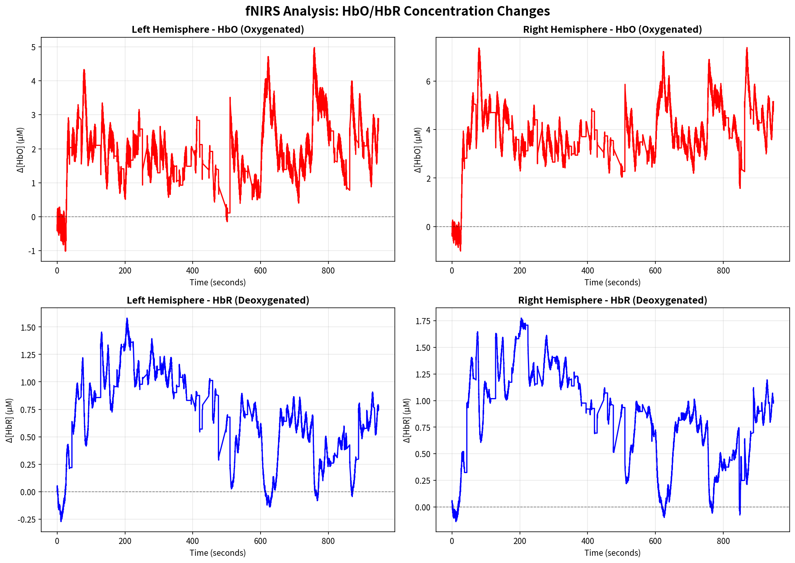
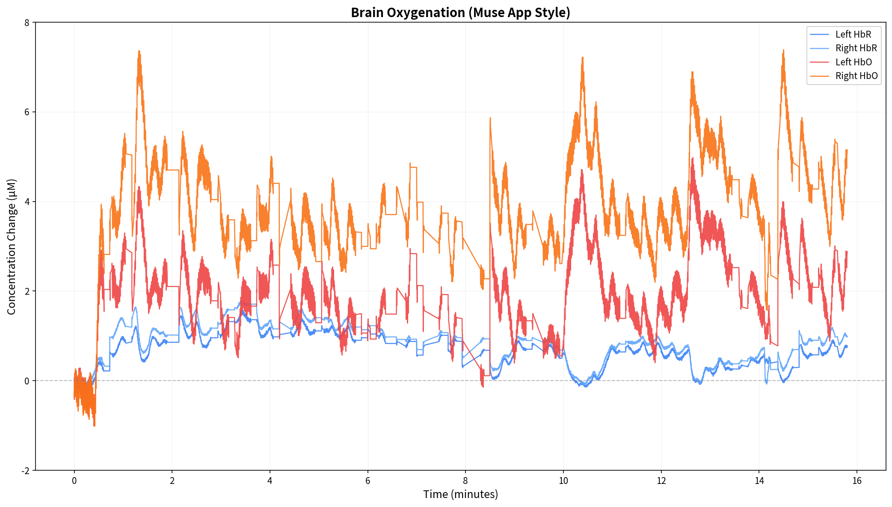
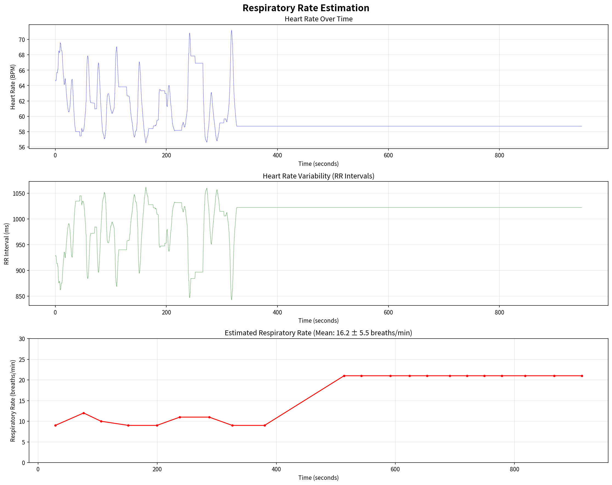
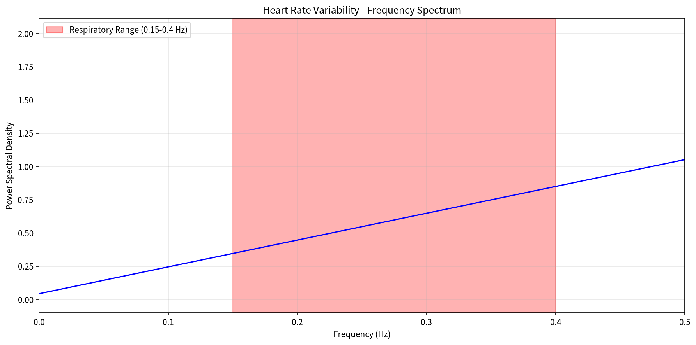
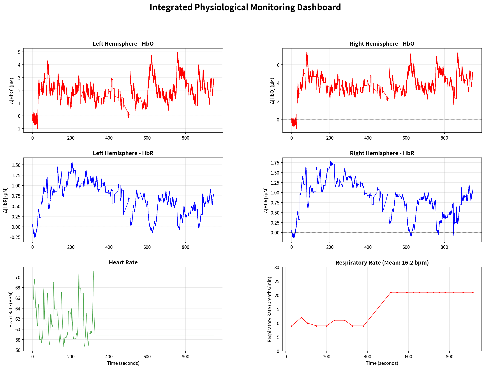

# Muse光学データ統合分析レポート

**生成日時**: 2025-10-30 18:12:55
**データファイル**: `mindMonitor_2025-10-15--17-08-15_2188947289907039573.csv`

---

## 1. データ概要

- **総レコード数**: 165068
- **計測時間**: 948.25 秒 (15.80 分)
- **推定サンプリングレート**: 174.08 Hz
- **有効Opticsチャネル数**: 4
- **有効心拍レコード数**: 165068
- **記録時間**: 2025-10-15 17:08:15.828000 ~ 2025-10-15 17:24:03.986000

## 2. fNIRS統計サマリー

|        |   HbO平均 |   HbO標準偏差 |   HbO最小 |   HbO最大 |   HbR平均 |   HbR標準偏差 |   HbR最小 |   HbR最大 |
|:-------|----------:|--------------:|----------:|----------:|----------:|--------------:|----------:|----------:|
| 左半球 |      2.00 |          0.97 |     -1.01 |      4.98 |      0.64 |          0.40 |     -0.27 |      1.58 |
| 右半球 |      3.91 |          1.35 |     -1.01 |      7.39 |      0.81 |          0.46 |     -0.14 |      1.77 |

### fNIRS時系列（4パネル）

### fNIRS時系列（Museアプリ風）

HbOの上昇は局所的な血流増加を示し、HbRの低下は酸素消費の高まりを示唆します。

## 3. 心拍変動と呼吸数推定

|   RR平均 (ms) |   RR標準偏差 (ms) |   RR最小 (ms) |   RR最大 (ms) |   Welch呼吸数 (breaths/min) |   FFT呼吸数平均 (breaths/min) |   FFT呼吸数標準偏差 (breaths/min) |
|--------------:|------------------:|--------------:|--------------:|----------------------------:|------------------------------:|----------------------------------:|
|       1005.18 |             39.53 |        842.69 |       1061.53 |                         nan |                         16.24 |                              5.55 |

### 心拍 & 呼吸数の時系列

### HRVスペクトル（Welch法）

赤色帯が呼吸周波数帯域 (0.15-0.4 Hz) を示します。

## 4. 統合ダッシュボード

fNIRSと心拍指標を同一キャンバスで確認できます。変化の同期性を評価する際に活用してください。

## 5. インサイトと所見

- 左右半球のHbO/HbR振幅を比較し、活動の偏りを評価してください。
- 呼吸数が急峻に変動する区間があれば、fNIRS指標と合わせてストレス反応を検討できます。
- Museアプリ風プロットでは、リアルタイム観察に近い感覚で変化を追跡できます。

### 補足メモ

- **同期性**: fNIRSと心拍系列のサンプル数が一致しています。

---

**生成スクリプト**: `generate_report.py`
**利用ライブラリ**: `lib/sensors/fnirs.py`, `lib/sensors/ppg.py`, `lib/visualization.py`