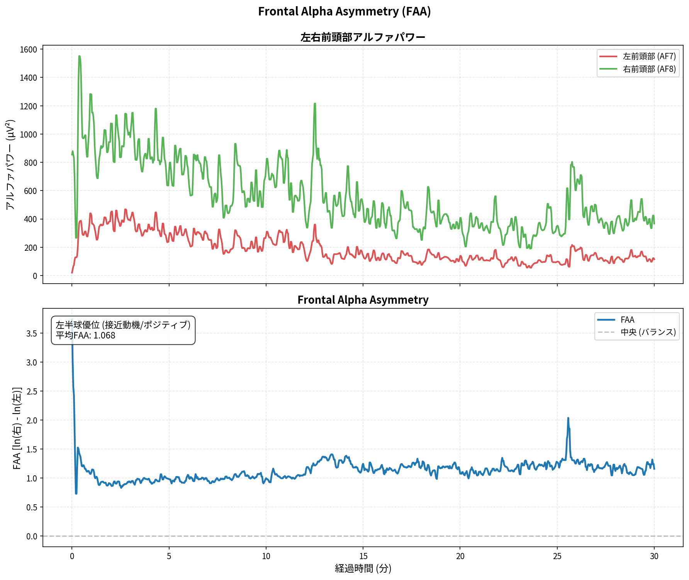

# Muse脳波データ分析レポート

- **生成日時**: 2025-11-01 18:44:45
- **データファイル**: `mindMonitor_2025-11-01--15-48-25_1605952226398231477.csv`
- **記録時間**: 2025-11-01 15:48:25 ~ 2025-11-01 16:18:24
- **計測時間**: 30.0 分

---

## 📡 接続品質

- **総合品質**: 優秀 (スコア: 1.00)
- **Good品質率**: 99.9%

### チャネル別詳細

| チャネル   |   Good (%) |   Medium (%) |   Bad (%) |   平均品質 |
|:-----------|-----------:|-------------:|----------:|-----------:|
| TP9        |      99.75 |         0.25 |      0.00 |       1.00 |
| AF7        |     100.00 |         0.00 |      0.00 |       1.00 |
| AF8        |     100.00 |         0.00 |      0.00 |       1.00 |
| TP10       |      99.75 |         0.25 |      0.00 |       1.00 |

> **注**: 1.0=Good, 2.0=Medium, 4.0=Bad

## 📊 分析サマリー

### セッション総合評価

- **リラックス度 (α/β)**: 70.667 (とても高い)
- **集中度 (β/θ)**: 4.449 (とても高い)
- **瞑想深度 (θ/α)**: 33.708 (深い)

### ピークパフォーマンス

- **最高パフォーマンス区間**: 15:48 - 15:53 (スコア: 0.91)

## 🧠 周波数帯域分析

### バンドパワー時系列

### パワースペクトル密度（PSD）

### スペクトログラム

## 🎯 特徴的指標分析

### Frontal Midline Theta (Fmθ)

| 指標               |      値 | 単位   |
|:-------------------|--------:|:-------|
| 平均値             | 114.757 | μV²    |
| 中央値             | 102.119 | μV²    |
| 標準偏差           |  55.508 | μV²    |
| 前半平均           | 150.611 | μV²    |
| 後半平均           |  78.823 | μV²    |
| 増加率 (後半/前半) | -47.664 | %      |

セッション後半の平均Fmθは前半比で **-47.7%** 変化しました。

### Peak Alpha Frequency (PAF)

**Individual Alpha Frequency (IAF)**: 9.90 ± 0.04 Hz

**チャネル別詳細**

| チャネル   |   PAF (Hz) |   Power (μV²/Hz) |
|:-----------|-----------:|-----------------:|
| TP9        |       9.97 |            30.50 |
| AF7        |       9.87 |            36.71 |
| AF8        |       9.87 |           110.52 |
| TP10       |       9.87 |           183.80 |

### Frontal Alpha Asymmetry (FAA)

| 指標     | 値                               | 単位    |
|:---------|:---------------------------------|:--------|
| 平均FAA  | 1.1267070783126638               | ln(μV²) |
| 中央値   | 1.1277080787317013               | ln(μV²) |
| 標準偏差 | 0.18840601739418925              | ln(μV²) |
| 前半平均 | 1.068143879806306                | ln(μV²) |
| 後半平均 | 1.1854004172601469               | ln(μV²) |
| 解釈     | 左半球優位 (接近動機/ポジティブ) |         |

> **解釈**: FAA = ln(右) - ln(左)。正値は左半球優位（接近動機・ポジティブ感情）、負値は右半球優位（回避動機・ネガティブ感情）を示唆します。

### バンド比率指標

| 指標               |   平均値 |   中央値 |   標準偏差 |   最小値 |      最大値 |
|:-------------------|---------:|---------:|-----------:|---------:|------------:|
| リラックス度 (α/β) |   70.667 |    2.706 |   8371.910 |    0.353 | 1116654.268 |
| 集中度 (β/θ)       |    4.449 |    0.979 |     93.511 |    0.271 |    8402.026 |
| 瞑想深度 (θ/α)     |   33.708 |    2.385 |   3034.919 |    0.057 |  402385.124 |

## 🩸 血流動態分析 (fNIRS)

### HbO/HbR時系列

### 統計サマリー

|        |   HbO平均 |   HbO標準偏差 |   HbO最小 |   HbO最大 |   HbR平均 |   HbR標準偏差 |   HbR最小 |   HbR最大 |
|:-------|----------:|--------------:|----------:|----------:|----------:|--------------:|----------:|----------:|
| 左半球 |      8.52 |          2.80 |     -4.06 |     14.77 |     -1.30 |          0.48 |     -2.25 |      0.06 |
| 右半球 |      6.96 |          2.55 |     -3.54 |     13.77 |     -1.48 |          0.65 |     -2.85 |      0.39 |

## ⏱️ 時間経過分析

### セグメント別パフォーマンス

### 詳細データ

| セグメント   | 時間帯        |   Fmθ平均 (μV²) |   IAF平均 (Hz) |   Alpha平均 (μV²) |   Beta平均 (μV²) |   θ/α比 | 備考   | ピーク   |
|:-------------|:--------------|----------------:|---------------:|------------------:|-----------------:|--------:|:-------|:---------|
| セグメント1  | 15:48 - 15:53 |         191.708 |         10.697 |             0.730 |            0.191 |   0.066 |        | ★        |
| セグメント2  | 15:53 - 15:58 |         141.187 |         10.674 |             0.644 |            0.185 |  -0.190 |        |          |
| セグメント3  | 15:58 - 16:03 |         119.572 |         10.741 |             0.579 |            0.095 |  -0.314 |        |          |
| セグメント4  | 16:03 - 16:08 |          80.928 |         10.712 |             0.484 |            0.019 |  -0.454 |        |          |
| セグメント5  | 16:08 - 16:13 |          67.453 |         10.660 |             0.444 |           -0.005 |  -0.521 |        |          |
| セグメント6  | 16:13 - 16:18 |          88.089 |         10.573 |             0.643 |            0.030 |  -0.078 |        |          |

