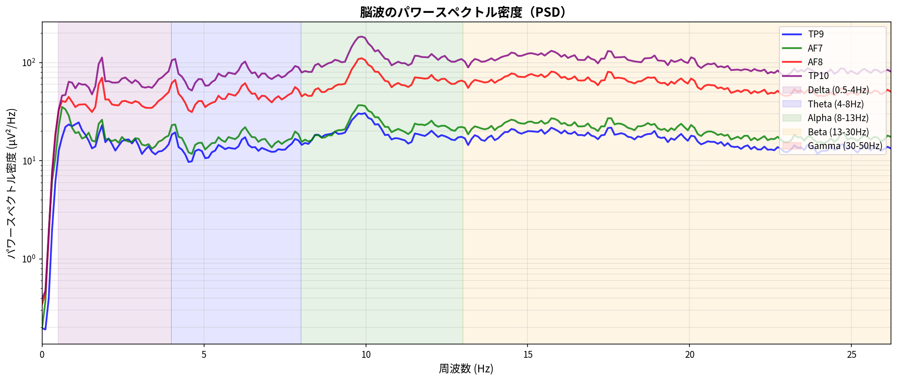
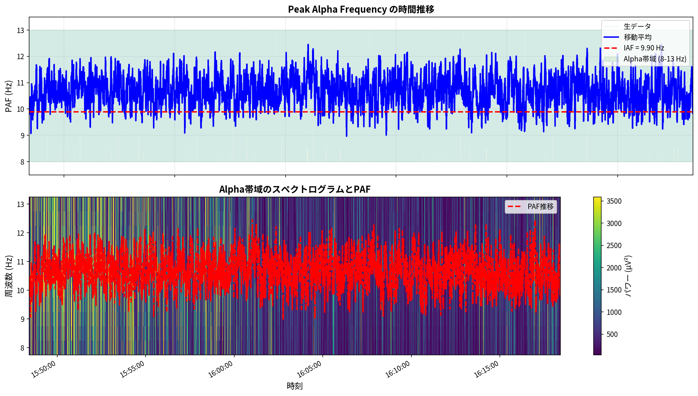

# Muse脳波データ分析レポート

## メタデータ

- **生成日時**: 2025-10-31 18:54:02
- **データファイル**: `mindMonitor_2025-10-31--16-04-01_7679417574001279836.csv`
- **記録時間**: 2025-10-31 16:04:02 ~ 2025-10-31 16:32:24
- **計測時間**: 28.4 分

---

## バンドパワー分析

### 周波数バンド統計

| バンド   |   平均値 |   標準偏差 |   有効データ率 (%) |
|:---------|---------:|-----------:|-------------------:|
| Delta    |   0.0077 |     0.3930 |            94.2184 |
| Theta    |   0.0287 |     0.4314 |            94.2184 |
| Alpha    |   0.8541 |     0.4046 |            94.2184 |
| Beta     |   0.1665 |     0.3140 |            94.2184 |
| Gamma    |   0.3700 |     0.2168 |            94.2184 |

### バンドパワーの時間推移

HeadBandOn/HSI良好データ使用率: 93.0%

Alpha波が高いとリラックス状態、Beta波が高いと集中状態を示します。

### パワースペクトル密度（PSD）

#### 各バンドのピーク周波数

| バンド   |   ピーク周波数 (Hz) |
|:---------|--------------------:|
| Delta    |                1.46 |
| Theta    |                4.39 |
| Alpha    |                8.79 |
| Beta     |               20.02 |
| Gamma    |               48.83 |

### スペクトログラム

時間とともに周波数分布がどう変化するかを可視化しています。

## バンド比分析

### 指標サマリー

| 指標               |   平均値 |   中央値 |   標準偏差 |   最小値 |    最大値 |
|:-------------------|---------:|---------:|-----------:|---------:|----------:|
| リラックス度 (α/β) |   17.075 |    4.327 |    359.498 |    0.924 | 33086.954 |
| 集中度 (β/θ)       |    3.617 |    0.856 |    108.518 |    0.162 | 10726.988 |
| 瞑想深度 (θ/α)     |    0.640 |    0.546 |      1.004 |    0.065 |    92.148 |

### セッション評価

- **リラックス度 (α/β)**: 17.075 (とても高い)
- **集中度 (β/θ)**: 3.617 (とても高い)
- **瞑想深度 (θ/α)**: 0.640 (浅い)

### データ品質（スパイク分析）

| 指標               |   外れ値数 |   外れ値割合 (%) |   変動係数 (%) |
|:-------------------|-----------:|-----------------:|---------------:|
| リラックス度 (α/β) |          2 |             1.18 |         216.50 |
| 集中度 (β/θ)       |          2 |             1.18 |         393.44 |
| 瞑想深度 (θ/α)     |          3 |             1.78 |          74.98 |

## Peak Alpha Frequency (PAF) 分析

### チャネル別PAF

| チャネル   |   PAF (Hz) |   Power (μV²/Hz) |
|:-----------|-----------:|-----------------:|
| TP9        |       8.79 |            12.94 |
| AF7        |       8.79 |            14.86 |
| AF8        |       8.79 |             6.99 |
| TP10       |       8.79 |             6.41 |

**Individual Alpha Frequency (IAF)**: 8.79 ± 0.00 Hz

### PAFの時間的変化

#### PAF統計

- **平均PAF (Hz)**: 10.49
- **中央値 (Hz)**: 10.50
- **標準偏差 (Hz)**: 1.92
- **最小値 (Hz)**: 8.00
- **最大値 (Hz)**: 13.00
- **変動係数 (%)**: 18.35

**PAF安定性評価**: 変動大

## fNIRS分析

### 統計サマリー

|        |   HbO平均 |   HbO標準偏差 |   HbO最小 |   HbO最大 |   HbR平均 |   HbR標準偏差 |   HbR最小 |   HbR最大 |
|:-------|----------:|--------------:|----------:|----------:|----------:|--------------:|----------:|----------:|
| 左半球 |      2.67 |          1.11 |     -0.92 |      6.38 |      0.94 |          0.64 |     -0.86 |      2.77 |
| 右半球 |      1.05 |          1.28 |     -2.34 |      5.05 |     -0.05 |          0.44 |     -1.53 |      1.22 |

### HbO/HbRの時系列

HbOの上昇は局所的な血流増加、HbRの低下は酸素消費の増大を示唆します。

