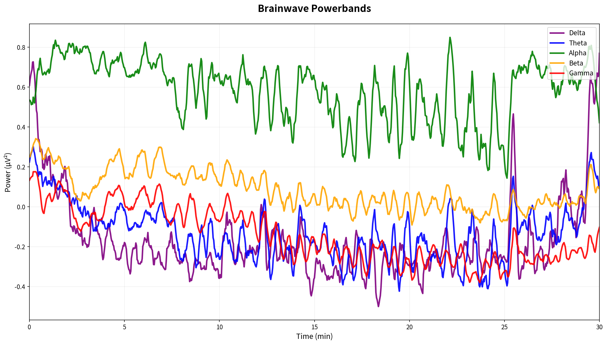
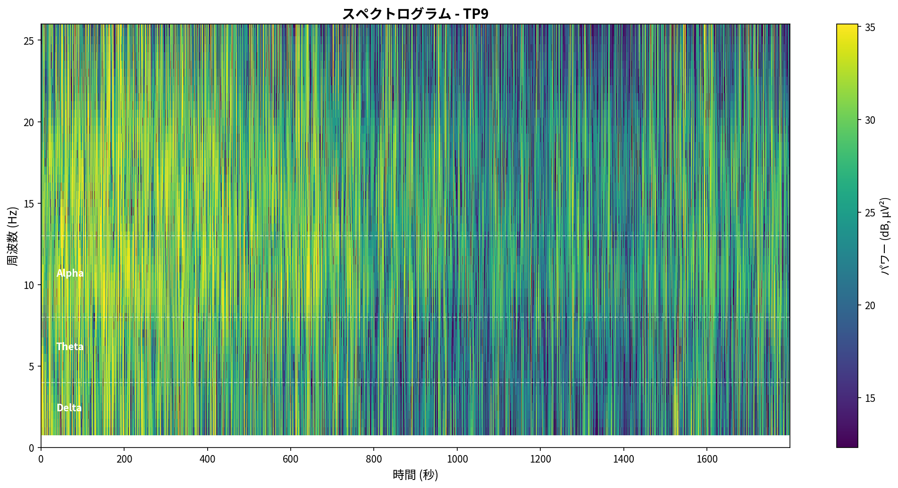
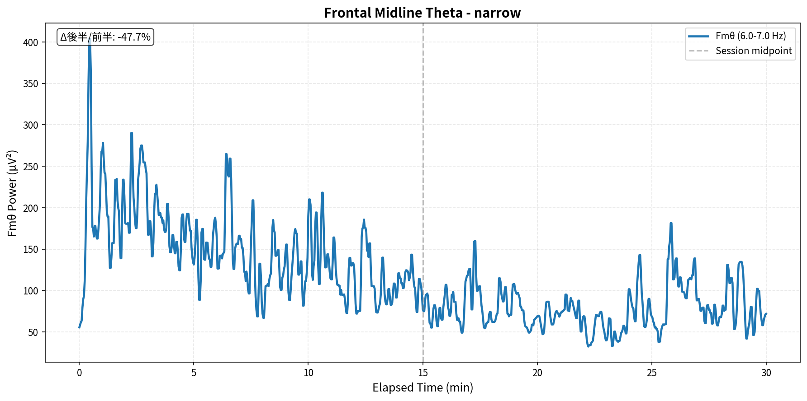
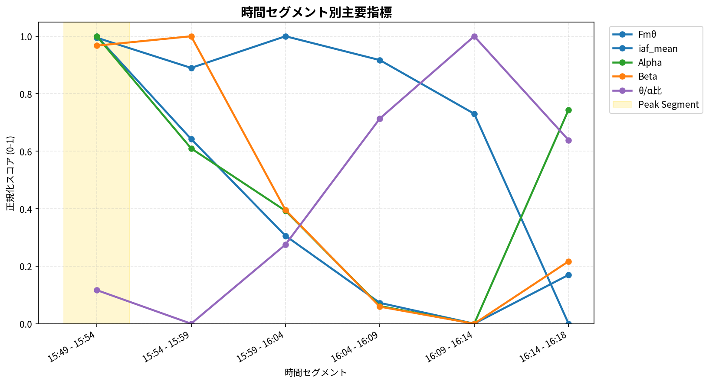

# Muse脳波データ分析レポート

- **生成日時**: 2025-10-31 21:52:05
- **データファイル**: `mindMonitor_2025-10-31--16-04-01_7679417574001279836.csv`
- **記録時間**: 2025-10-31 16:04:02 ~ 2025-10-31 16:32:24
- **計測時間**: 28.4 分

---

## 📊 分析サマリー

### セッション総合評価

- **リラックス度 (α/β)**: 17.075 (とても高い)
- **集中度 (β/θ)**: 3.617 (とても高い)
- **瞑想深度 (θ/α)**: 0.640 (浅い)

### ピークパフォーマンス

- **最高パフォーマンス区間**: 16:04 - 16:09 (スコア: 0.67)

## 🧠 周波数帯域分析

### バンドパワー時系列

### パワースペクトル密度（PSD）

### スペクトログラム

### データ品質

- **良好データ使用率**: 95.1%

| 指標               |   外れ値数 |   外れ値割合 (%) |   変動係数 (%) |
|:-------------------|-----------:|-----------------:|---------------:|
| リラックス度 (α/β) |          2 |             1.18 |         216.50 |
| 集中度 (β/θ)       |          2 |             1.18 |         393.44 |
| 瞑想深度 (θ/α)     |          3 |             1.78 |          74.98 |

## 🎯 特徴的指標分析

### Frontal Midline Theta (Fmθ)

| 指標               |      値 | 単位   |
|:-------------------|--------:|:-------|
| 平均値             |  14.948 | μV²    |
| 中央値             |   9.192 | μV²    |
| 標準偏差           |  16.005 | μV²    |
| 前半平均           |  22.453 | μV²    |
| 後半平均           |   7.442 | μV²    |
| 増加率 (後半/前半) | -66.854 | %      |

セッション後半の平均Fmθは前半比で **-66.9%** 変化しました。

### Peak Alpha Frequency (PAF)

**Individual Alpha Frequency (IAF)**: 8.79 ± 0.00 Hz

**チャネル別詳細**

| チャネル   |   PAF (Hz) |   Power (μV²/Hz) |
|:-----------|-----------:|-----------------:|
| TP9        |       8.79 |            13.47 |
| AF7        |       8.79 |            13.20 |
| AF8        |       8.79 |             7.10 |
| TP10       |       8.79 |             6.90 |

### バンド比率指標

| 指標               |   平均値 |   中央値 |   標準偏差 |   最小値 |    最大値 |
|:-------------------|---------:|---------:|-----------:|---------:|----------:|
| リラックス度 (α/β) |   17.075 |    4.327 |    359.498 |    0.924 | 33086.954 |
| 集中度 (β/θ)       |    3.617 |    0.856 |    108.518 |    0.162 | 10726.988 |
| 瞑想深度 (θ/α)     |    0.640 |    0.546 |      1.004 |    0.065 |    92.148 |

## 🩸 血流動態分析 (fNIRS)

### HbO/HbR時系列

### 統計サマリー

|        |   HbO平均 |   HbO標準偏差 |   HbO最小 |   HbO最大 |   HbR平均 |   HbR標準偏差 |   HbR最小 |   HbR最大 |
|:-------|----------:|--------------:|----------:|----------:|----------:|--------------:|----------:|----------:|
| 左半球 |      2.67 |          1.11 |     -0.92 |      6.38 |      0.94 |          0.64 |     -0.86 |      2.77 |
| 右半球 |      1.05 |          1.28 |     -2.34 |      5.05 |     -0.05 |          0.44 |     -1.53 |      1.22 |

## ⏱️ 時間経過分析

### セグメント別パフォーマンス

### 詳細データ

| セグメント   | 時間帯        |   Fmθ平均 (μV²) |   IAF平均 (Hz) |   Alpha平均 (μV²) |   Beta平均 (μV²) |   θ/α比 | 備考          | ピーク   |
|:-------------|:--------------|----------------:|---------------:|------------------:|-----------------:|--------:|:--------------|:---------|
| セグメント1  | 16:04 - 16:09 |          14.894 |         10.520 |             0.924 |            0.280 |   0.102 |               | ★        |
| セグメント2  | 16:09 - 16:14 |         nan     |        nan     |             0.856 |            0.221 |   0.072 | Fmθデータ不足 |          |
| セグメント3  | 16:14 - 16:19 |         nan     |        nan     |             0.879 |            0.120 |   0.061 | Fmθデータ不足 |          |
| セグメント4  | 16:19 - 16:24 |         nan     |        nan     |             0.820 |            0.107 |  -0.018 | Fmθデータ不足 |          |
| セグメント5  | 16:24 - 16:29 |         nan     |        nan     |             0.774 |            0.081 |  -0.042 | Fmθデータ不足 |          |
| セグメント6  | 16:29 - 16:32 |         nan     |        nan     |             0.653 |            0.039 |  -0.235 | Fmθデータ不足 |          |

