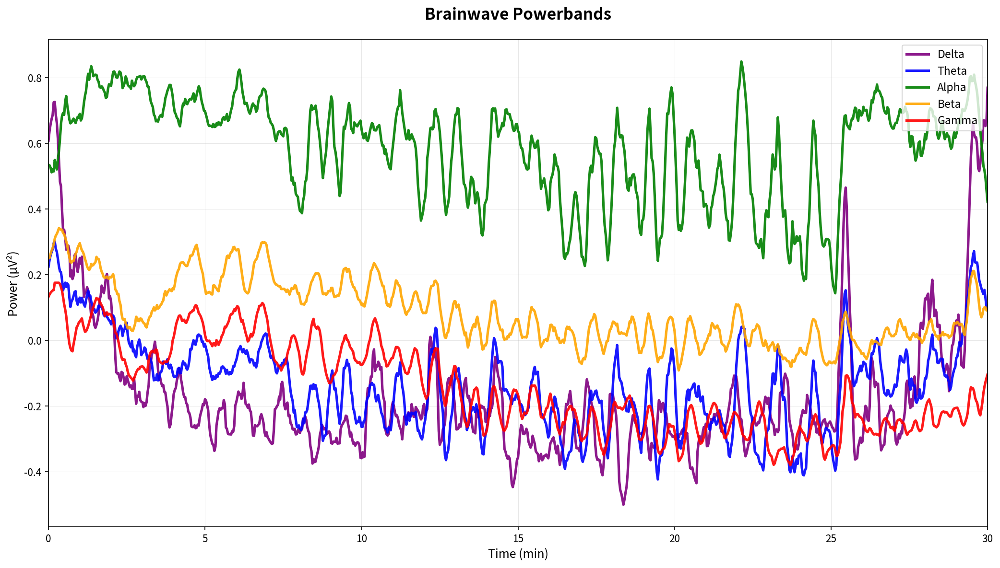
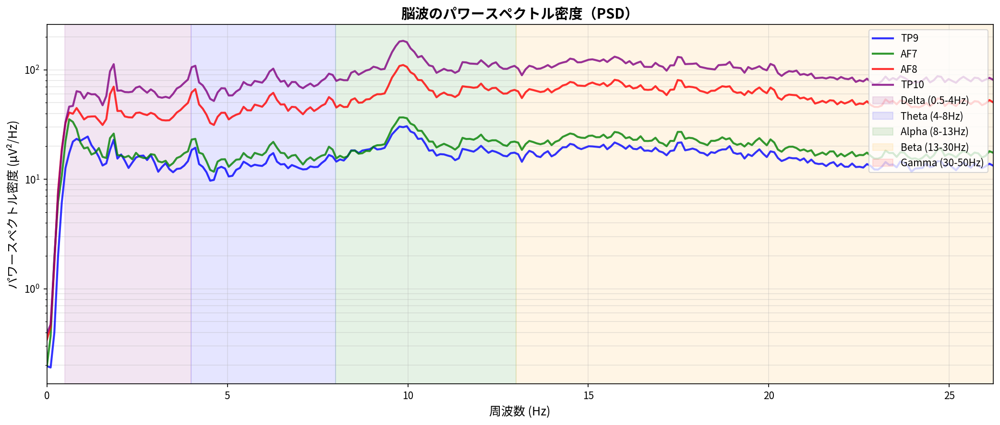
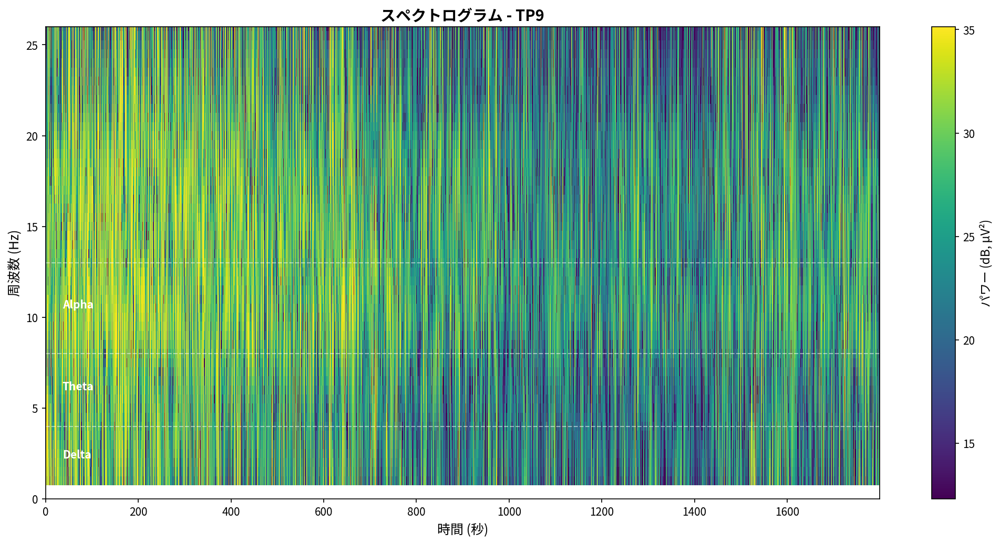
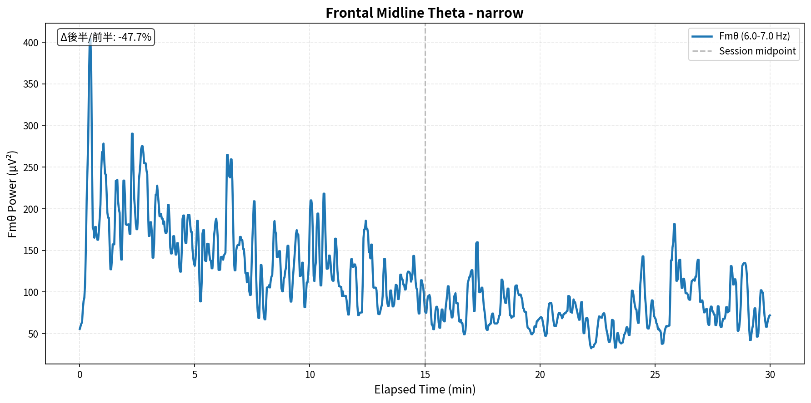
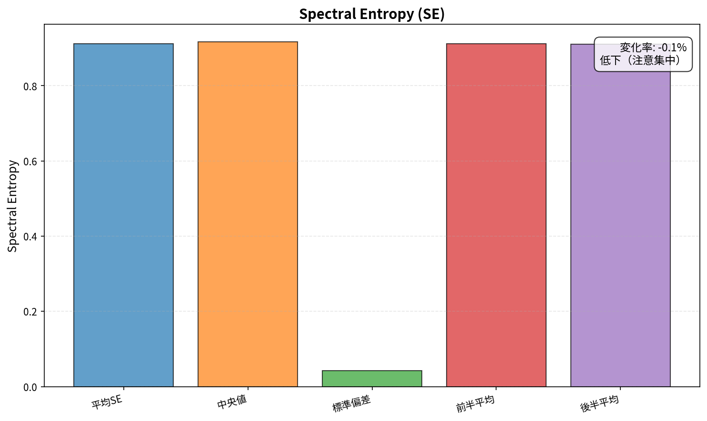

# Muse脳波データ分析レポート

- **生成日時**: 2025-11-03 14:03:00
- **データファイル**: `mindMonitor_2025-11-01--15-48-25_1605952226398231477.csv`
- **記録時間**: 2025-11-01 15:48:25 ~ 2025-11-01 16:18:24
- **計測時間**: 30.0 分

---

## 📡 接続品質

- **総合品質**: 優秀 (スコア: 1.00)
- **Good品質率**: 99.9%

### チャネル別詳細

| チャネル   |   Good (%) |   Medium (%) |   Bad (%) |   平均品質 |
|:-----------|-----------:|-------------:|----------:|-----------:|
| TP9        |      99.75 |         0.25 |      0.00 |       1.00 |
| AF7        |     100.00 |         0.00 |      0.00 |       1.00 |
| AF8        |     100.00 |         0.00 |      0.00 |       1.00 |
| TP10       |      99.75 |         0.25 |      0.00 |       1.00 |

> **注**: 1.0=Good, 2.0=Medium, 4.0=Bad

## 📊 分析サマリー

### 総合評価

- **総合スコア**: 44.0/100 (要改善)

**スコア内訳**

- 瞑想深度 (Fmθ): 43.2/100 (要改善)
- 集中度 (SE): 29.5/100 (要改善)
- 瞑想深度 (θ/α): 13.8/100 (要改善)
- リラックス度 (α/β): 76.7/100 (良好)
- 周波数安定性 (IAF): 88.1/100 (優秀)

### セッション総合評価

- **リラックス度 (α/β)**: 7.901 (とても高い)
- **集中度 (β/θ)**: 2.683 (とても高い)
- **瞑想深度 (θ/α)**: 7.373 (深い)

### ピークパフォーマンス

- **最高パフォーマンス区間**: 15:49 - 15:54 (スコア: 46.9/100)

## 🧠 周波数帯域分析

### バンドパワー時系列

### パワースペクトル密度（PSD）

### スペクトログラム

## 🎯 特徴的指標分析

### Frontal Midline Theta (Fmθ)

| 指標               |      値 | 単位   |
|:-------------------|--------:|:-------|
| 平均値             | 114.757 | μV²    |
| 中央値             | 102.119 | μV²    |
| 標準偏差           |  55.508 | μV²    |
| 前半平均           | 150.611 | μV²    |
| 後半平均           |  78.823 | μV²    |
| 増加率 (後半/前半) | -47.664 | %      |

セッション後半の平均Fmθは前半比で **-47.7%** 変化しました。

### Peak Alpha Frequency (PAF)

**Individual Alpha Frequency (IAF)**: 9.90 ± 0.04 Hz

**チャネル別詳細**

| チャネル   |   PAF (Hz) |   Power (μV²/Hz) |
|:-----------|-----------:|-----------------:|
| TP9        |       9.97 |            30.50 |
| AF7        |       9.87 |            36.71 |
| AF8        |       9.87 |           110.52 |
| TP10       |       9.87 |           183.80 |

### Frontal Alpha Asymmetry (FAA)

| 指標     | 値                               | 単位    |
|:---------|:---------------------------------|:--------|
| 平均FAA  | 1.1267070783126638               | ln(μV²) |
| 中央値   | 1.1277080787317013               | ln(μV²) |
| 標準偏差 | 0.18840601739418925              | ln(μV²) |
| 前半平均 | 1.068143879806306                | ln(μV²) |
| 後半平均 | 1.1854004172601469               | ln(μV²) |
| 解釈     | 左半球優位 (接近動機/ポジティブ) |         |

> **解釈**: FAA = ln(右) - ln(左)。正値は左半球優位（接近動機・ポジティブ感情）、負値は右半球優位（回避動機・ネガティブ感情）を示唆します。

### Spectral Entropy (SE)

| 指標               |     値 | 単位   |
|:-------------------|-------:|:-------|
| 平均SE             |  0.911 | 正規化 |
| 中央値             |  0.917 | 正規化 |
| 標準偏差           |  0.042 | 正規化 |
| 前半平均           |  0.912 | 正規化 |
| 後半平均           |  0.911 | 正規化 |
| 変化率 (後半/前半) | -0.103 | %      |

セッション後半のエントロピーは前半比で **-0.1%** 変化しました。
**解釈**: 低下（注意集中）

> **解釈**: Spectral Entropyは周波数成分の多様性を示します。低い値は特定の周波数帯に集中（集中状態）、高い値は広帯域に分散（散漫状態）を示唆します。

### バンド比率指標

| 指標               |   平均値 |   中央値 |   標準偏差 |   最小値 |   最大値 |   IQR |   除外サンプル数 |
|:-------------------|---------:|---------:|-----------:|---------:|---------:|------:|-----------------:|
| リラックス度 (α/β) |    7.901 |    2.706 |     74.212 |    0.353 | 5355.075 | 2.355 |               26 |
| 集中度 (β/θ)       |    2.683 |    0.978 |      9.937 |    0.271 |  266.000 | 1.053 |              520 |
| 瞑想深度 (θ/α)     |    7.373 |    2.384 |     56.004 |    0.057 | 3794.935 | 2.910 |              104 |

> **注**: 統計値は外れ値（Z-score > 3）を除外して計算されています。IQRは四分位範囲（75%点 - 25%点）を示します。

## 🩸 血流動態分析 (fNIRS)

### HbO/HbR時系列

### 統計サマリー

|        |   HbO平均 |   HbO標準偏差 |   HbO最小 |   HbO最大 |   HbR平均 |   HbR標準偏差 |   HbR最小 |   HbR最大 |
|:-------|----------:|--------------:|----------:|----------:|----------:|--------------:|----------:|----------:|
| 左半球 |      8.52 |          2.80 |     -4.06 |     14.77 |     -1.30 |          0.48 |     -2.25 |      0.06 |
| 右半球 |      6.96 |          2.55 |     -3.54 |     13.77 |     -1.48 |          0.65 |     -2.85 |      0.39 |

## ⏱️ 時間経過分析

### セグメント別パフォーマンス

### 詳細データ

| セグメント   | 時間帯        |   Fmθ平均 (μV²) |   IAF平均 (Hz) |   Alpha平均 (Bels) |   Beta平均 (Bels) |   θ/α比 (Bels) | 備考   | ピーク   |
|:-------------|:--------------|----------------:|---------------:|-------------------:|------------------:|---------------:|:-------|:---------|
| セグメント1  | 15:49 - 15:54 |         182.192 |         10.717 |              0.740 |             0.170 |         -0.762 |        | ★        |
| セグメント2  | 15:54 - 15:59 |         141.910 |         10.700 |              0.629 |             0.176 |         -0.775 |        |          |
| セグメント3  | 15:59 - 16:04 |         103.971 |         10.718 |              0.567 |             0.069 |         -0.745 |        |          |
| セグメント4  | 16:04 - 16:09 |          77.681 |         10.704 |              0.473 |             0.009 |         -0.697 |        |          |
| セグメント5  | 16:09 - 16:14 |          69.525 |         10.673 |              0.456 |            -0.001 |         -0.665 |        |          |
| セグメント6  | 16:14 - 16:18 |          88.656 |         10.552 |              0.667 |             0.037 |         -0.705 |        |          |

